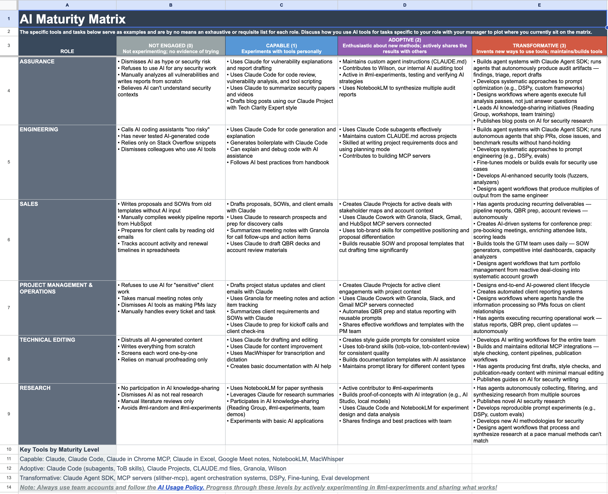
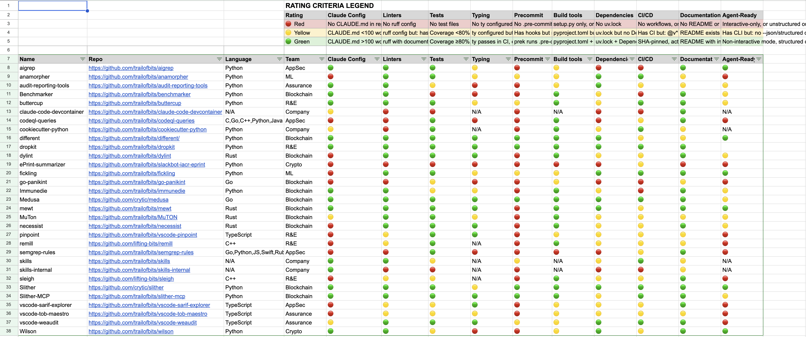

AI isn't a feature you "adopt." It is a force that commoditizes effort and shortens the half-life of best practices, especially in security work where trust, evidence, and privacy are non-negotiable. This talk explains the strategy used to turn Trail of Bits into an AI-native consulting firm. The core idea is a compounding operating system built from incentives, defaults, guardrails, and verification loops that let humans and autonomous agents ship high-rigor work at dramatically higher throughput.

The talk covers the concrete artifacts that make this real: internal and external skills repositories, a curated marketplace for third-party skills, opinionated configuration baselines, and sandboxing patterns. It then addresses what changes when AI output scales: pricing, staffing, and delivery models evolve when discovery becomes abundant.

Finally, it presents the full vision: to build a firm that compounds faster than the ecosystem changes, and to do it in a way others can copy as a playbook rather than a vendor pitch.

