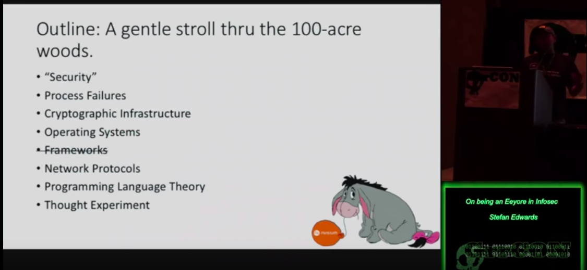
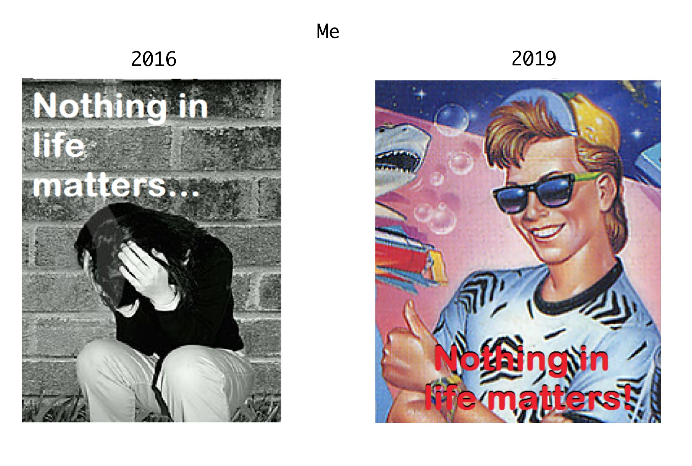
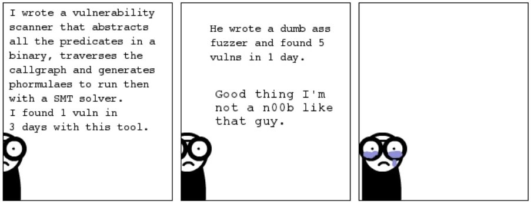

# Return to the Hundred Acre Woods
### what I've learnt in 3 years
### _or_
### 3eeyore5u

---

# `$ finger lojikil`

```
[lojikil.com]
Stefan Edwards (lojikil) is not presently logged in.

- Assurance Practice Lead, Trail of Bits
- Twitter/GitHub/Lobste.rs: lojikil
- Works in: Defense, FinTech, Blockchain, IoT, compilers,
vCISO services
- Previous: net, web, adversary sim, &c.
- Infosec philosopher, professional programming
language theorist, everyday agronomer, father.

WARNING: DEAF
WARNING: Noo Yawk
```

---

# in 2016 I gave this talk


<!--
probably one of my favorite talks ever;

Covered nihilism, security, everything that I saw as wrong in the IT/IS

page_number: true
footer: Return to the Hundred Acre Woods :: lojikil
-->

---

# this talk

- cover what I've seen going from traditional infosec to high(er) assurance work
- talk about application of formal techniques & cryptography
- why none of this will save you, I'm still Eeyore


 `=>` 

---

<!--

talk about the areas I had covered previously, and lay out why they 
are still issues now
-->

# take aways

## no golden roads to security

1. TINSTAAFL: formal tools & cryptography aren't panaceas 
2. There is no golden road to ~~arithmetic~~ security
3. Formally proven code fails, fancy crypto breaks, OS setups can multiply problems 

---

# me: 2016 vs 2019

## 2016
- OSINT, threat modeling, blackbox, web, net, lots of gov, finance

## 2019
- those + formalisms, PLT, more exposure to fancy crypto

---



<!-- as you can see, a lot has changed, even if not everything
has changed.

Life has more color now... even if it's meaningless...
-->

---

# when I said "security, I meant...

- design +
- denotation +
- formalized & verified model +
- centralized security controls +
- decentralized implementation ==
- "secure"

<!--

when I said "security" previously, I really did mean this...

-->
---

# now when I say security...

- Not much has changed


<!--

Now I'm actually working in the space that I had previously spoken about

There are many things outside the realm of what we do, both for security and correctness,
but we work in the intersection of the two, and it's quite nice

-->

---

# let's update ourselves


<!--

So given that I now work at a place that specializes in this sort of correctness, things
are... better... right?

Also, I love writing these notes to myself, because I know I will ignore them and
likely no one else will read them. It's the coup de grace of notes really

-->

---

# formal tools won't save you

2016

- Java: Java Modeling Language (JML)
- C: Frama-C
- [fancy formal languages no one uses] : [fancy formal tools no one uses]
  - Eiffel, Sather, Lissac, any other DBC language there
  - TLA+, ACL2, &c were also alive
  - Ada has been around since forever

<!-- these were the sorts of tools I was seeing & partially using in 2016... -->

---

# formal tools won't save you

- tools were verbose
- often unused, difficult to use, or unknown

<!-- seriously, how many people *know* what JML is? -->

---

# a formal aside

- JML is > 20 years old (first specs & such from 1999)
- multiple compiler support it
- industry standard...
- "just" Hoare logic
- ... with large, longitudinal case studies...
- ... virtually unused

---

# formal in 2019

- regularly interact with formal tooling
- since joining ToB, have written two, one for a client
- ease of use has gotten better
  - in Ethereum, there are *many* to chose from
- tend to lean towards ease of use vs specificity
  - lots of verifiers, less specifiers
  - more built in tests

<!--

- maybe talk about specification vs verification
- talk about the types of things we see tested...
- how tests are starting to work...

-->

---
# formal in 2019

```python
contract_src="""
contract Adder {
    function incremented(uint value) public
    returns (uint){
        if (value == 1)
            revert();
        return value + 1;
    }
}
"""
# ...
value = m.make_symbolic_value()

contract_account.incremented(value)
# ...
for state in m.ready_states:
    print("can value be 1? {}".format(
        state.can_be_true(value == 1)))
```

<!--

- so here we have a simple example of a reduced Manticore script
- Manticore will generate all states within a program
- THIS IS SUPER ACCESSIBLE! basically anyone with python experience can do this
-->

---

# formal in 2019


<!--

- diagram of paths
- talk about state explosion
- size of analysis vs path explosion
- average size of contracts

-->
---

# formal in 2019

- pros:
  - much easier to start now
  - multiple implementations, geared towards devs, CI/CD
- cons:
  - the usual negatives
- as we'll see: formally proven/verified code *can* fail 

<!--

- symbex & other formal techniques have trade offs
- 

-->

---

# formally a failure

<!--

I think the thing that bothers me most is that folks think 

formally verified 

==

secure

your assurance is only as good as your spec/tests and your, and your time invested is only as much as your risk/threat model allows.

There's a reason why NASA projects cost so much...
-->

- only as good as your spec/verification
  - spec bugs
  - under spec
  - not spec'ing the right thing
- can't test everything

---

# formally a failure

- tested code != prod code
  - Ariane 5 rocket
- things look positive
  - client proved with `uint`, then switched to `int`
- lots of blockchain examples

<!--

some of the worst examples we have are from formally proven blockchain projects

We, Consensys, many firms see code that is formally proven have severe bugs in them. We only test what we can think of.

-->

---

# fuzzing won't save you


<!--

so very often when we see symbex as a problem, we turn to fuzzing...

-->

---

# fuzzing contra symbex


_from http://deniable.org/reversing/symbolic-execution_

---

# fuzzing in 2016

- SecLists
- Radamsa
- AFL
- QuickCheck (for Haskell), Hypothesis (Python)
  - available, but unused 
- some exotic stuff like DART

_https://patricegodefroid.github.io/public_psfiles/talk-pldi2005.pdf_

---

# fuzzing in 2019

- those, plus
- easily accessible grammar fuzzers
  - Mozilla Dharma, various others
- grey-box fuzzers
  - ECLIPSER
- other combinations of symbex + fuzzing
  - concretize via fuzzing
  - negate paths ala SAGE
- **property-based testing** is much more common

---

# a fuzzy aside

- i still fine a ton of vulns with radamsa
- `radamsa -v -o $SOMEPATH` is so stupidly effective

---

# fuzzing in 2019

<!-- 

so what *is* property testing?

-->

- property-based testing is p popular now
- allows developers to write simple properties that must hold
  - `userIds <= 10000`
  - `fromAddress != toAddress`  
- simple to write, often within the same language
- testing tool:
  1. generates random calls to API w/ random data
  2. shrinks random call graph to minimum
  3. all to find combinations that violate properties

---

# fuzzing in 2019

<!--

keeping with how I'm showing our tools, let's look at PBT in Echidna

Talk about what we're attempting to do, how the test is repeatable, &c.

-->

```
contract TEST is NewCoin {
  uint private initSupply;
  address private alice = ...;
  address private bob = ...;
  address private eve = ...;

  constructor() public {
    balances[alice] = 10000;
    balances[bob] = 10000;
    balances[eve] = 10000;
    initSupply = totalSupply_;
  }
  // the actual good stuff:
  function echidna_test() public returns (bool) {
    totalSupply_ = balances[alice] + balances[bob] +
    balances[eve];
    return (initSupply == totalSupply_);
  }
}
```
---

# fuzzing in 2019

- pros:
  - can find many edge cases
  - tools have become lightweight & easier to control
- cons
  - unlikely to randomly generate complex formats
  - anything > pure random takes time
- (more) ideal, combine constraint gen with fuzzing

---

# fuzzy failure

- what you fuzz matters
- but so does **how** you fuzz

<!--

Talk about the VM fuzz

-->
---

<!--

I've been  asked a few times if you can replace unit  tests with fuzzing

No, no you cannot

you're losing out on intent, what developers thought code should do, and you're attempting to automatically uncover hermaneutics of code...

-->
# i'm fuzzy on this one point

- as an aside, fuzzing, symbex, &c don't replace tests
  - tests show expected result, intent
  - fuzzing shows potential edge cases
  - symbex, absint show domain/codomain
- both are useful 

---

# fancy crypto won't save you


---

# crypto in 2016

- mostly FIPS-140 types of stuff
- sometimes a rec for removing SHA
  - use PBKDF2, bcrypt, scrypt
- pining to use SRP 

---

# crypto in 2019

<!--

in 2019, I work with real math people
we have answers to the problems of 
yesteryear, with real audits behind them...

-->

- work with actual cryptographers
- lots and lots of math
- better systems
  - libsodium, tink 
  - ~~SRP~~ various PAKEs
  - Argon2
  - Oblivious Functions
- so everything is better... right?

---

# crypto in 2019

<!--

It turns out that most of the problems I see in cryptography are
operational in nature

-->

- keys written to disk with `0777` or `0655`
- keys in memory that an attacker can access
- keys stored on GitHub
- lots of incorrect applications
  - signature? hash? who knows! 
- must. use. all. the. keys.

---

<!--

I'm not smart, and if I can see
obvious flaws in the way you implemented things or use them,
an attacker will too 

-->

# also, stop implementing your own crypto

- I don't want to review it
- it's probably wrong

---

# ALSO if it's REALLY new, don't use it

<!--

Even something as "well understood"
as non-interactive zero-knowledge 
proofs had a major bug in them

Zcash had a counterfeit bug because
of some advanced crypto that wasn't
well understood at inception

-->
- you may not implement it correctly
- the library isn't audited
- we don't understand it
- zk-SNARKs 

---

# operating systems won't save you

<!--

I think this is interesting, because there's been quite a few changes since 2016

-->


---

# OSs in 2016

- mostly on prem
- Windows, Trusted Solaris, Linux
- some SELinux, some CAC access
- occassional orchestration, CM 

<!--

in 2016 when I said OSs were terrible
I was mostly working with this set.

In some ways it was better: on prem 
has many audit controls we might want
and it also provides more 

We'd also occassionally see an orchestration management system, more likely we'd see something like ansible or the like, just barely
automating what folks were doing

-->

---

# OSs in 2019

- lots of orchestration
- almost 100% Linux
- containers == more security... right?

---

# OSs in 2019

<!--

So, ignoring simple docker errors
like devs choosing the wrong image

we have quite a few potential expansions in our attack surface just from using a container...

-->

- ignoring simple docker failures
- k8s: by default disabled seccomp
  - since fixed 
- docker: multiple vulns, often used w/o a KSM
- gvisor: disabled seccomp

---

# OSs in 2019


- must pay attention to defaults
- by themselves, not a security mechanism
- not worse, but false sense of security


---

# even if you get those things right, you don't win


<!--

talk about

- breaks in formally proven code, due to either missing the correct formalisms, or w/e
- talk about misapplications of crypto vis-a-vis implementation complexity, incorrect application, &c.

so we covered all the ways these 
modern tools can fail, but there's still no guarantee that it's secure...

-->

---

<!--

there are many ways to still end up with issues, and you can't actually model all of the things, verify the people,&c.

you're also still assuming some level
of inherited controls when you have
these sorts of systems...

-->

# you still don't win

- so you did everything right
  - want a cookie? 
- there are still a number of otherways to lose
  - formally verify people?
  - crypto your way around a hardware bug?
  - SGX failures, k8s issues, &c. 

---

# the only winning move, is not to play

- reduce your surface area
- employ full range of:
  - threat modeling
  - maturity modeling
  - traditional SAST/DAST
  - fuzzing 
  - design spec
  - verification (appropos of your risk)

---

# and then you still die

<!--

even with DLP/leak systems, users will work around what you've thought of.

-->

- someone commits prod keys to GH

---

# thanks!


