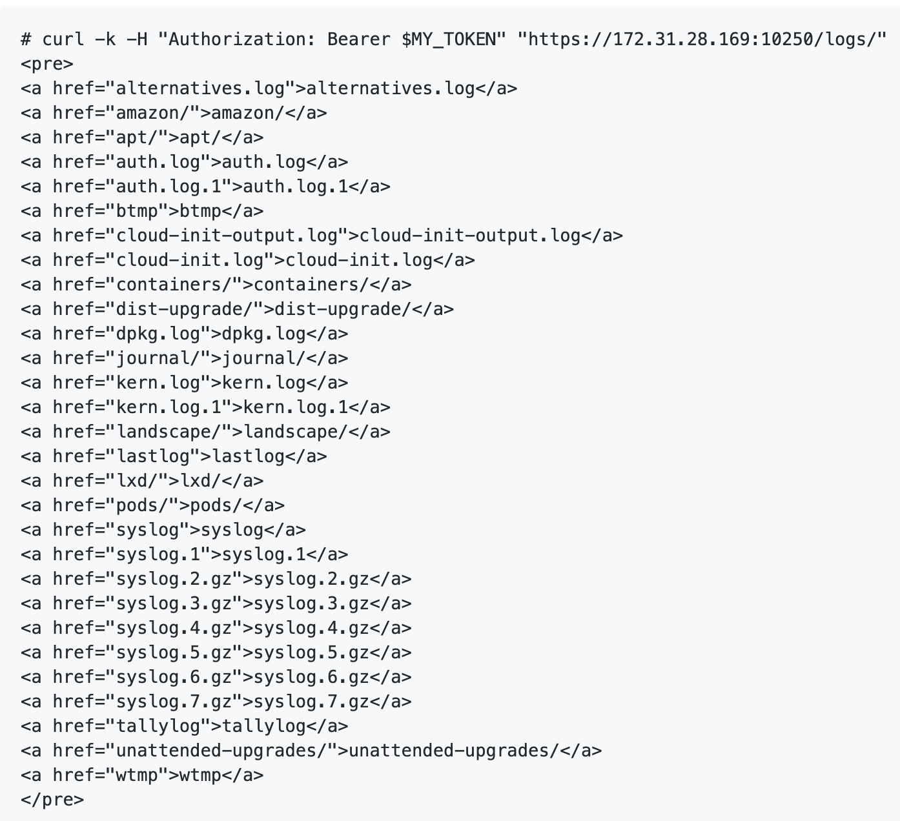

# swimming with the kubectl fish
## the why, the how, the what of the CNCF Kubernetes Assessment

---
<!--
page_number: true
footer: @lojikil//Trail of Bits//swimming with the kubectl fish
-->

# `git blame` 

```
[lojikil.com]
Stefan Edwards (lojikil) is not presently logged in.

- Principal Security Consultant at Trail of Bits
- Twitter/Github/Lobste.rs: lojikil
- Works in: Defense, FinTech, Blockchain, IoT, compilers,
vCISO services
- Previous: net, web, adversary sim, &c.
- Infosec philosopher, amateur^wprofessional programming
language theorist, everyday agronomer, father.

WARNING: DEAF
WARNING: Noo Yawk
```

---

<!--

- what we were actual asked to do
- how we did it
- and some of the things we actually found 
- we'll probably run out of time, so you can view the slides 

-->

# outline
1. intro
1. outline
1. takeaways
1. the why: audit objectives
1. the how: modeling & assessing large FLOSS
1. the what: selected vulns

---

# takeaways

1. large, heterogeneous codebase (~3.7m SLoC) 
2. developers have different threat model than yours
3. lurking assumptions, threats, and vulnerabilities 

## github.com/trailofbits/audit-kubernetes

---

# the why

- Cloud Native Computing Foundation (CNCF)
- Linux Foundation project
- "owns" k8s
- promotes containers
- first _code level_ public audit
  - & TM, whitepaper, reference impl... 

---


# the why: audit objectives

<!--

- low hanging fruit: meant to find _obvious_ bugs, and reduce their number
- threat model: understand the complete data flow from start to finish
- deliver a set of recommendations for running k8s on your lonesome

-->

- meant to find new bugs
- desired result?
  - low hanging fruit
  - threat model
  - relatively secure base configuration 

---

# the why: anti-objectives

- "red team" (adversary) lateral movement w/o novel bug
- Helm/Brigade/kops/Whatever bugs
- cloud-provider specific bugs
- previously-known issues
- that means
  - novel bugs
  - open source system
  - with many eyes & users
  - within base k8s   

---

# the why: results

- a security review: 37 findings
- a threat model: 17 findings + control analysis 
- a white paper: ergonomics of k8s

---

# the why: empower other researchers

- more-complete data flow, control analysis, & threats
  - CNCF's SIGSEC
- areas where more bugs lurk 
  - Nico Waisman's integer-width bug hunt with Semmle
- direction for k8s devs
  - Craig Ingram mapping all findings to GH issues
  - GKE mapping the findings to GKE's own controls
- future audits

---

# the how 

- easily a more interesting part
- unique tooling & ideas
- lots and lots of ~~RipIt~~ Code Reading

---

# the how: interesting stats

- subcomponents: kube-apiserver, etcd, KCM/CCM, kube-scheduler, kubelet, kube-proxy, CRI
- control families: authentication, authorization, cryptography, secrets management, networking, "multi-tenancy"
  - last one was a hard one
- against k8s 1.13.4
- All told? 2.7+ mSLoC Go, 126+ kSLoC C, &c.

---


---

# the how: the problems

<!-- NOTES:
 - Govet broke
 - gosec is mixed
 - Go's package management is weird...
 - it's hard to do, unlike say npm audit or cargo-audit
 - show of hands, how many have audited large code bases without tooling help?
 -->
- go static analysis tools are a mixed bag
- minimal tooling specifically for k8s **at a code level**
- enormous code base
- with lots of components, styles, companies...
- minimal dataflow, connection analysis, &c.

---

# the how: top level approach

1. Kubernetes in Action + Running Clusters
1. container sec class
1. "Kubernetes Clusters I have Known and Loved"
1. prep the code into `audit-kubernetes`
    1. https://github.com/trailofbits/audit-kubernetes       

---

# the how: code

- mainly manual: lots of `ack` (me) or Goland (normal people), some code indexing
- internal checklist of golang problems
- minimal: govet, gosec, errcheck (actually did help to kickstart)
- `hypothesis => stare at code => ... => profit`


---

# the how: code (part deux)

sidebar if I had to again:

- ~~use signal, use tor~~ use Semmle, use Custom Golang tooling
- Nico has found **24 more instances** of bugs with simple searches in Semmle
- More kernel faulting via krf

---

# the how: threat modeling

- I use a slightly-different approach 
  - Brian Glas (@infosecdad) & I have worked on for ~10 years
- Controls, Data, Gaps, Inherited Controls... all par for the course
- **NEW** Mozilla Rapid Risk Assessment (RRA) docs 

---

# the how: threat modeling FLOSS?

<!--
- what are the things we need for a threat model?
- defined users? nope we don't have them
- responsible devs? nope, most aren't paid directly by CNCF
- business direction? nope, many applications, many users, different spaces
-->

- what do we need in threat modeling?
  - ~~defined users~~ distributed user base
  - ~~responsible devs~~ distributed, unpaid dev base
  - ~~business direction~~ minimal overarching purpose

---

# the how: threat modeling FLOSS

1. design rough dataflow
    1. k8s docs aren't fun
    1. k8s in Action, but slightly out of date  
1. talk with developers
1. write up notes (lives on GitHub)
1. report threats, control analysis, &c. 
 
---

# the how: talk with developers 

1. Pre-fill RRAs
2. Email SIGs for meetings
3. Meeting with Devs
4. Send RRA documents back to SIGs for PR
5. Iterate
6. Write Report

### https://github.com/trailofbits/audit-kubernetes/commits/master/notes/stefan.edwards/rra

---

# the what: 3 things

1. devs have widely varied skill-levels & backgrounds
2. Linux interfaces are non-trivial to code against
3. preponderance of (policy) choice 

---

# the what: devs

- devs come from a wide background
- what does this do?

```
        v, err := strconv.Atoi("4294967377")
        g := int32(v)
        fmt.Printf("v: %v, g: %v\n", v, g);
```

---

# the what: devs

- Issues?
  - Unsigned to Signed
  - Wrong Width: `$GO_ARCH`-specific width to 16/32/64 bits
  - Both: many flows of `strconv.Atoi` => `int16`
- devs may not have background on machine-width ints
- TOB-K8S-015 & Appendix B 

---

# the what: devs 

- We found a number of flows from Incorrect Widths/Sign
- Nico Waisman (of Semmle) found _many_

```
if len(s) > 1 && (s[0] == 'E' || s[0] == 'e') {
parsed, err := strconv.ParseInt(string(s[1:]), 10, 64)
	if err != nil {
		return 0, 0, DecimalExponent, false
	}
	return 10, int32(parsed), DecimalExponent, true
}
```

---

# the what: devs

- a wide range of audit/logging backgrounds
- high security vs standard applications
- end result?
  - TOB-K8S-001: Bearer tokens are revealed in logs
  - TOB-K8S-026: Directory traversal of host logs running kube-apiserver and kubelet
  - TOB-K8S-007: Log rotation is not atomic
  - TOB-K8S-TM05: Credentials exposed in environment variables and command-line
  - TOB-K8S-TM06: Names of secrets are leaked in logs 

<!-- logging things that shouldn't be logged, missing logging, log rotation -->

---

# the what: devs 

<!-- 

- not just organizationally distributed
- not just geographically distributed
- contextually distributed too
- the dev working on round trip may not have context for what happens in an admission controller like authN
- the dev *also* may not be testing with the same configuration as deployed in prod 
  -  For example: some providers *only* use two-way TLS, so would never see a bearer token in logs  

-->

- devs often do not have context between items 
- diff components have diff devs
- innocuous code leads to problems

```
if rt.levels[debugCurlCommand] {
   klog.Infof("%s", regInfo.toCurl())
}

if rt.levels[debugRequestHeaders] {
   // ...
}
```

---

# the what: devs 

- we need logs!
- logs are hard coded to go to "/var/log"
- we need to see & display logs
- what else lives in /var/log?

---

# the what: devs

- innocuous code:

```
func logFileListHandler(req *restful.Request, 
resp *restful.Response) {
       logdir := "/var/log"
       http.ServeFile(resp.ResponseWriter, 
       req.Request, logdir)
   }
```

---

<!--

now suddenly anyone with k8s access now has access to logs from the host, or anything that hits /var/log, and
since it runs as root... they can read them all.

-->



---

# the what: devs
 
- k8s uses many files
- k8s **does not** have standard routines for permissions nor a model
- TOB-K8S-004: Pervasive world-accessible file permissions

---

# the what: devs

<!-- 

again, developers don't often have context, so they don't know
where a particular routine will be used, and so they just write
something that works, regardless of what it leaks to the world...

Can anyone spot what's wrong with these lines?

- In docs, the mantra is "access to etcd is root access to the cluster"
- if backups are world writeable/readable, huge problems
-->

```
cluster/images/etcd/migrate/data_dir.go:49:
err := os.MkdirAll(path, 0777)
cluster/images/etcd/migrate/data_dir.go:87:
err := os.MkdirAll(backupDir, 0777)
```

---

# the what: devs

<!--

- there are *many* things we have to be careful of
- logs, credentials on hosts, &c. all have file permissions issues
- many of these operational concerns fall onto operators' shoulders 

-->

- not picking on etcd
  - logs
  - credentials
  - other info
- you **must** pay attention to operational concerns 
  - no on is coming, it's up to us 
  
---

# the what: linux

<!-- meant for "container orchestration" via "pods"

but containers themselves are a lie; in theory they're an separation boundary, in reality they're just a set of 
system calls atop the same kernel everything else runs
-->

- k8s runs "pods"
- containers are a **lie**
- theory: containers are separation boundaries
- reality: namespaces + cgroups + ... = same kernel
- let's look at  cgroups

---

# the what: linux

<!-- interaction with PIDs and cgroups, combined with
some misunderstanding of what is *actually* relayed by
cgroups 

This leads to at least two-direct cgroup issues...
-->

- resource allocation/specification
- hierarchical model of groupings
- sometimes moved
- Issues?
  - TOB-K8S-022: TOCTOU when moving PID to manager's cgroup via kubelet
  - TOB-K8S-021: Improper fetching of PIDs allows incorrect cgroup movement

---

# the what: linux

- TOB-K8S-022 allows privesc
- Attacker can now read/write host devices
  - ... limited by AppArmor now 

---

# the what: linux

<!-- likewise, PID checks are not what you expect! -->

- PIDs are also hard, ala TOB-K8S-022
- But so is `procfs` in general
- What does this code do?

```
func isKernelPid(pid int) bool {
       _, err := os.Readlink(fmt.Sprintf("/proc/%d/exe", 
       pid))
       return err != nil
}
```

---

# the what: linux

- kernel threads not expected to have a `/proc/$PID/exe`
- We can cause `os.Readlink` to fail
- Now you're a kernel PID...

---

# the what: linux

<!-- 

lastly, let's talk about seccomp.

- a state that limits a process' interaction with the system
- extended with seccomp-bpf that filters syscalls
- used by docker & co limit things
- can be used in an "unconfined mode" which basically turns it off
-->

- seccomp?
-  limits syscalls (or filters with bpf)
- used by docker, &c for security
- use of `unconfined` generally a vuln
  - TOB-K8S-002: Seccomp is disabled by default 

---

# the what: linux

- Linux APIs are hard
- misconfigured or unapplied

---

# the what: policy

- Kubernetes allows us to apply policies
  - Think PSP & NetworkPolicy
- two main issues:
  - application silently fails
  - can have complex failure modes

---

# the what: policy

<!-- PSP is an admission controller, basically a gate keeper,
for k8s clusters. it allows cluster admins to restrict the 
actions a service account can take. In doing so, it returns 
a validation error. This is good, right?
-->

- PodSecurityPolicy (PSP)
- restricts service accounts
- validation error 
- good... right?

---

# the what: policy

<!-- 
Originally, it was disabled by default, and attempting to 
apply it actually met with no warning. So in essence, you could
create a super strong policy 
-->

- was disabled
- no warning
- result?
  - I've created a strong policy...
  - with no application

---

# the what: policy

- NetworkPolicy too
- restricts ingress/egress
- sets up inter-pod comms
- oops! chose a CNI that doesn't apply NetworkPolicy
- TOB-K8S-TM01: Policies may not be applied

---

# the what: policy

- besides silent failure...
- complex failure mode
- Many, many components
- they manage & interact in odd ways
- for example

---

# the what: policy

<!--

- Many components interact with many other resources
- the scope of that interaction may change
- So what stops a request? authN? AuthZ? Admissions Control?
- This sort of scope change actually leads to components having tacked on security, which leads to problems, such as 
- `hostPath` restrictions in PSP can actually lead to a bypass 

-->

- where do we restrict? complex interactions
  - AuthN? AuthZ? AC? PSP? WebHook?
- mo Scope, mo problems
- PSP includes validation for `hostPath` **BUT**
- PSP's inclusion leads to `hostPath` validation bypass
- So, add security, get a vuln (TOB-K8S-038)

---

# Thanks!

- wild ride, thanks for joining
- Questions?

